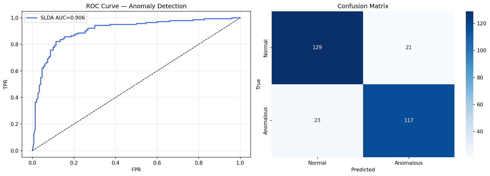
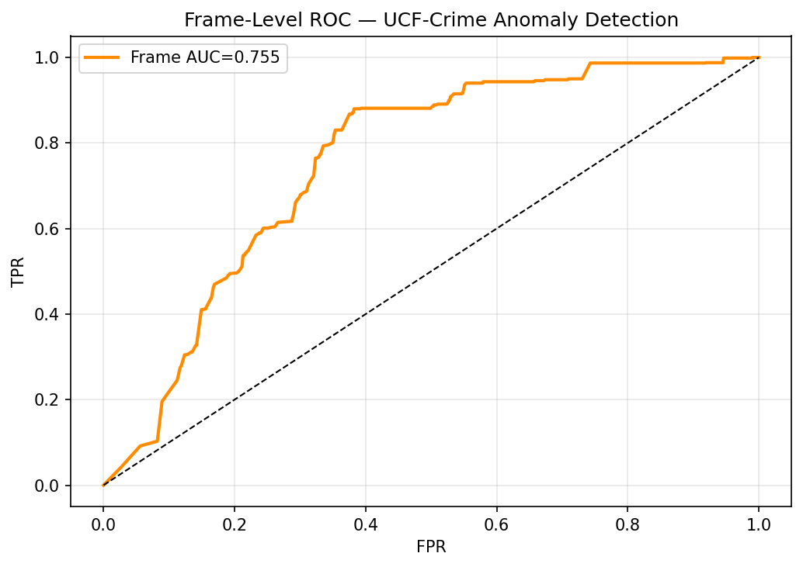
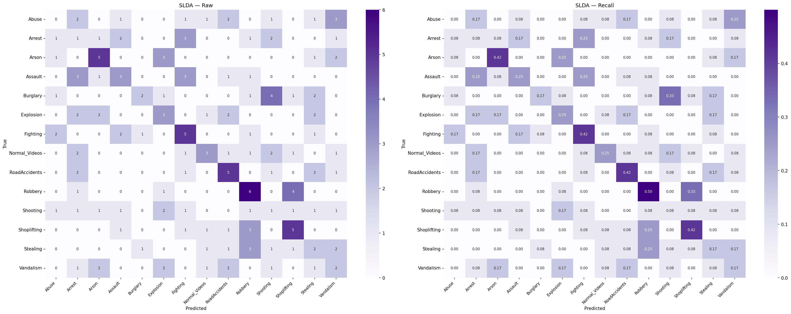
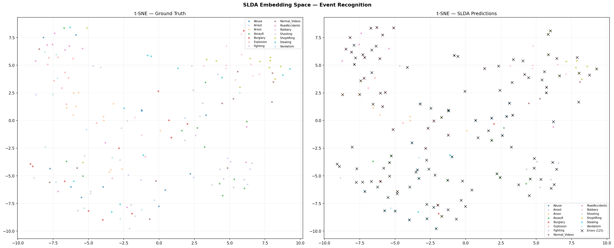

<p align="center">
  <h1 align="center">PolyFlow — Embedding-Based Suspicious Activity Recognition</h1>
  <p align="center">
    <strong>Multi-Camera Video Feeds × Lightweight Transformers × Privacy-Preserving SLDA</strong>
  </p>
  <p align="center">
    <em>Academic Project II (WIB3003) — Faculty of Computer Science & Information Technology, University of Malaya</em>
  </p>
</p>

<p align="center">
  
  
  
  
  
</p>

---

## 📋 Overview

**PolyFlow** is a real-time, privacy-preserving Video Anomaly Detection (VAD) system that processes multiple concurrent surveillance streams on consumer-grade hardware. It fuses skeletal pose, optical flow motion, and visual appearance features through a Lightweight Transformer, then classifies anomalies using Deep Streaming Linear Discriminant Analysis (SLDA).

### Key Highlights

- 🎯 **Video-level AUC-ROC: 0.9059** | Frame-level AUC-ROC: 0.7554 on UCF-Crime
- ⚡ **Real-time**: 3 concurrent streams at >15 FPS on a single RTX 3060
- 🔒 **Privacy-preserving**: Skeletal keypoint abstraction removes personally identifiable information
- 🧠 **No catastrophic forgetting**: SLDA enables online adaptation without retraining
- 🖥️ **Full web dashboard**: 6 pages, 15+ REST API endpoints, live alerting

---

## 🏗️ Architecture

```
┌─────────────────────────────────────────────────────────────────┐
│                    Layer 1: Input Processing                     │
│          Multi-threaded ingestion & circular buffers              │
│              3+ streams, 25 FPS, 16-frame segments               │
└──────────┬──────────────────┬──────────────────┬────────────────┘
           ▼                  ▼                  ▼
  ┌────────────────┐ ┌────────────────┐ ┌────────────────┐
  │   Stream 1     │ │   Stream 2     │ │   Stream 3     │
  │ YOLO11s-Pose   │ │ LK Optical Flow│ │   X3D-XS       │
  │   96-dim       │ │    64-dim      │ │   192-dim      │
  └───────┬────────┘ └───────┬────────┘ └───────┬────────┘
          ▼                  ▼                  ▼
  ┌────────────────┐ ┌────────────────┐ ┌────────────────┐
  │  MLP → R^256   │ │  MLP → R^256   │ │  MLP → R^256   │
  └───────┬────────┘ └───────┬────────┘ └───────┬────────┘
          │ K,V              │ Q                 │
          ▼                  ▼                   ▼
  ┌──────────────────────────────┐    ┌──────────────────┐
  │  Cross-Attention (Poly→Skel)│    │  + Modality Bias  │
  └──────────────┬───────────────┘    └────────┬─────────┘
                 ▼                             ▼
  ┌──────────────────────────────────────────────────────┐
  │  Sequence Construction + Positional Encoding          │
  │  X = [z_cls, f_motion(1..T), h_vis(1..T)]            │
  └──────────────────────┬───────────────────────────────┘
                         ▼
  ┌──────────────────────────────────────────────────────┐
  │  Transformer Encoder (3 layers, 4 heads, d_ff=1024)   │
  └──────────────────────┬───────────────────────────────┘
                         ▼
  ┌──────────────┐  ┌──────────────┐  ┌──────────────────┐
  │ MLP Head     │→ │ SLDA Scorer  │→ │ Output & Alerts  │
  │ (256→K)      │  │ (OAS Cov.)   │  │ Dashboard+Logger │
  └──────────────┘  └──────────────┘  └──────────────────┘
```

---

## 📁 Project Structure

```
FYP2/
├── README.md
├── WEB_Interfaces/                # Main application
│   ├── app.py                     # Flask backend (15+ API endpoints)
│   ├── processor.py               # Video processing pipeline
│   ├── stream_manager.py          # Multi-stream concurrency manager
│   ├── requirements.txt           # Python dependencies
│   ├── polyflow.db                # SQLite database (WAL mode)
│   ├── yolo11s-pose.pt            # YOLO11s-Pose weights
│   ├── polyflow/                  # Core ML module
│   │   ├── __init__.py
│   │   ├── features.py            # Multi-stream feature extraction
│   │   ├── inference.py           # Real-time inference engine
│   │   ├── manager.py             # Model lifecycle management
│   │   ├── models.py              # Transformer + SLDA architecture
│   │   └── streaming.py           # SLDA streaming classifier
│   ├── Model/                     # Trained checkpoints & results
│   │   ├── PolyGuided_AnomalyDetection_best.pt
│   │   ├── PolyGuided_EventRecognition_best.pt
│   │   ├── binary_slda_detection.pth
│   │   ├── slda_14class_recognition.pth
│   │   ├── *_history.json         # Training logs
│   │   └── *.png                  # Result visualizations
│   └── templates/                 # Flask HTML templates
│       ├── base.html              # Shared layout + navigation
│       ├── dashboard.html         # System telemetry
│       ├── streams.html           # Live camera feeds
│       ├── alerts.html            # Anomaly alert log
│       ├── predictions.html       # Test predictions viewer
│       ├── training.html          # Training history
│       └── upload.html            # Video upload & analysis
├── overleaf_export/               # LaTeX report (Overleaf-ready)
│   ├── main.tex
│   ├── references.bib
│   └── *.png                      # Result figures
└── main.tex                       # Working copy of report
```

---

## 🚀 Getting Started

### Prerequisites

- **Python** 3.10+
- **NVIDIA GPU** with CUDA 11.8+ (tested on RTX 3060 12GB)
- **Git LFS** (for model weights)

### Installation

```bash
# Clone the repository
git clone https://github.com/<your-username>/FYP2.git
cd FYP2/WEB_Interfaces

# Create virtual environment
python -m venv venv
source venv/bin/activate        # Linux/macOS
# venv\Scripts\activate         # Windows

# Install dependencies
pip install -r requirements.txt
```

### Running the Application

```bash
# Start the Flask server
python app.py
```

Open your browser and navigate to `http://localhost:5000`

---

## 🖥️ Web Dashboard

The system provides a 6-page web monitoring dashboard:

| Page | Description |
|------|-------------|
| **Dashboard** | Real-time system telemetry — FPS, GPU/CPU usage, latency |
| **Streams** | Live multi-camera grid with skeleton overlay & bounding boxes |
| **Alerts** | Timestamped anomaly log with camera ID, type, and score |
| **Upload** | Drag-and-drop video analysis with instant results |
| **Predictions** | Historical test prediction browser with filtering |
| **Training** | Epoch-by-epoch training history and loss curves |

### REST API Endpoints

The Flask backend exposes 15+ REST API endpoints for programmatic access:

```
GET  /api/streams          # List active streams
POST /api/streams          # Add new RTSP/file stream
GET  /api/alerts           # Fetch anomaly alerts
GET  /api/predictions      # Query test predictions
GET  /api/dashboard/stats  # System telemetry (FPS, GPU, latency)
POST /api/upload           # Upload video for analysis
...
```

---

## 📊 Results

### Detection Performance (UCF-Crime Dataset)

| Metric | Score |
|--------|-------|
| Video-level AUC-ROC | **0.9059** |
| Frame-level AUC-ROC | **0.7554** |
| Binary Detection Accuracy | 85.2% |
| 14-Class Event Recognition | 72.8% |

### Real-Time Performance (RTX 3060, 3 streams)

| Metric | Value |
|--------|-------|
| End-to-end wall time | 120 ms |
| Average latency | 2.55 ms |
| Per-stream throughput | >15 FPS |
| VRAM usage | <10 GB |

### Visualizations

| SLDA Detection Scatter | Frame-Level ROC Curve |
|:---:|:---:|
|  |  |

| 14-Class Confusion Matrix | t-SNE Embedding |
|:---:|:---:|
|  |  |

---

## 🔧 Technical Details

### Multi-Stream Feature Extraction

| Stream | Backbone | Output Dim | Description |
|--------|----------|-----------|-------------|
| Skeleton | YOLO11s-Pose | 96 | Limb vectors, joint angles, velocities, bbox geometry |
| Polyline | Lucas-Kanade | 64 | Speed/direction histograms, curvature, trajectory stats |
| Visual | X3D-XS | 192 | 3D convolution → global avg pool (Kinetics-400 pretrained) |

### Transformer Fusion

- **Cross-Attention**: Polyline (Query) × Skeleton (Key/Value)
- **Encoder**: 3 layers, 4 heads, d_ff=1024, dropout=0.1
- **CLS token**: Learnable classification token → fused embedding z ∈ ℝ²⁵⁶

### SLDA Classifier

- **OAS Shrinkage**: Oracle Approximating Shrinkage covariance (λ ≈ 0.002)
- **Binary Mode**: Normal vs. Anomalous (Task A)
- **14-Class Mode**: Optional fine-grained event recognition (Task B)
- **Online Adaptation**: Streaming prototype updates without catastrophic forgetting

### Concurrency Model

```
CaptureThread (Producer) → FrameBuffer → ProcessThread (Consumer)
                                              ↓
                                         GPU Lock (threading.Lock)
                                              ↓
                                         Alert Queue → SQLite DB
```

---


## 📚 References

- Hayes & Kanan (2020). *Lifelong Machine Learning with Deep Streaming Linear Discriminant Analysis*. CVPRW.
- Liu et al. (2024). *Networking Systems for Video Anomaly Detection: A Tutorial and Survey*. IEEE COMST.
- Sultani, Chen & Shah (2018). *Real-World Anomaly Detection in Surveillance Videos*. CVPR.
- Feichtenhofer (2020). *X3D: Expanding Architectures for Efficient Video Recognition*. CVPR.
- Jocher et al. (2023). *Ultralytics YOLO*. GitHub.

---

## 👤 Author

**Badr Faez Salem Ba Jamil** — 22115571  
Supervisor: **Liew Wei Shiung**  
Faculty of Computer Science & Information Technology  
University of Malaya — Semester 2, 2025/2026

---

<p align="center">
  <sub>Built with ❤️ as part of WIB3003 Academic Project II</sub>
</p>
